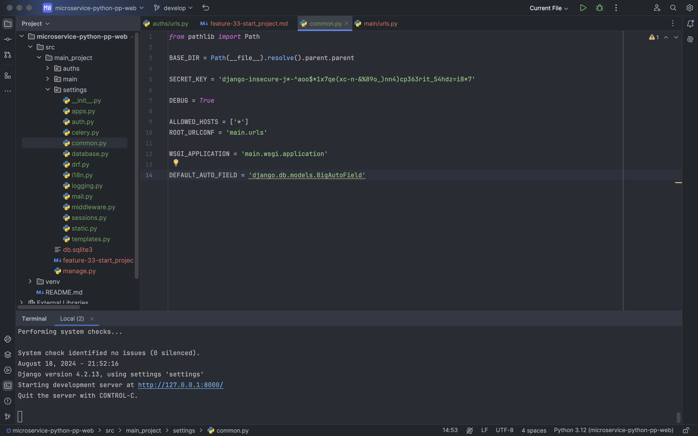

# Задача #33: Создание django-проекта 

## Описание
Проект создан с нуля и отрефакторированы настройки (settings.py)

## Шаги выполнения

1. **Проекта Django**:
   - Основная папка проекта `main`.
   - Проект создан в папке `src`.

2. **Приложения `aссounts`**:
   - Приложение добавлено и настроено.
   - Путь к приложению прописан в `urls.py`.
   - Приложение доступно по адресу `localhost/auth/hi/` и выводит текст: "Первые строчки проекта созданы".

3. **Рефакторинг настроек**:
   - Файл `settings.py` вынесен в папку `settings`.
   - Настройки разделены по отдельным файлам:
     - `apps.py`
     - `auth.py`
     - `celery.py`
     - `common.py`
     - `database.py`
     - `drf.py`
     - `i18n.py`
     - `logging.py`
     - `mail.py`
     - `middleware.py`
     - `sessions.py`
     - `static.py`
     - `templates.py`

4. **Настройки в `common.py`**:
   - Основные параметры конфигурации вынесены в `common.py`.

5. В проекте используется файл **.env** для хранения конфиденциальных настроек, таких как ключи API, секретный ключ Django, параметры базы данных и другие переменные окружения.
Пример структуры файла .env
```env
SECRET_KEY='123456789'
CSRF_TRUSTED_ORIGINS=['localhost']
5. ```
**Важно**: Без добавления SECRET_KEY и других необходимых параметров, проект не запустится.

Убедитесь, что файл .env добавлен в .gitignore, чтобы избежать его случайной публикации в репозитории.

Файл **.env** необходимо создать вручную в корне проекта.

## Скриншот
Приложение успешно запущено и обновлено. Скриншот работы приложения прилагается ниже.



Установите зависимости:
   ```bash
   pip install -r requirements.txt
```
